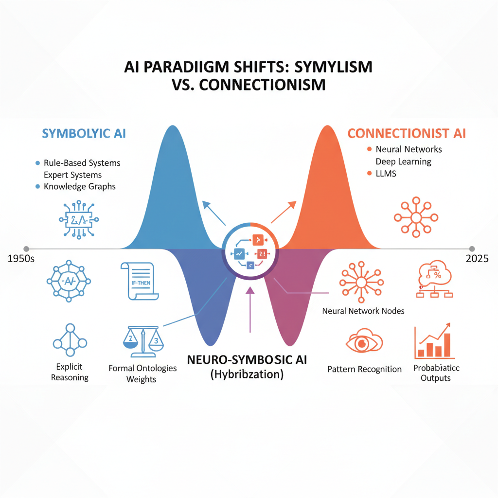
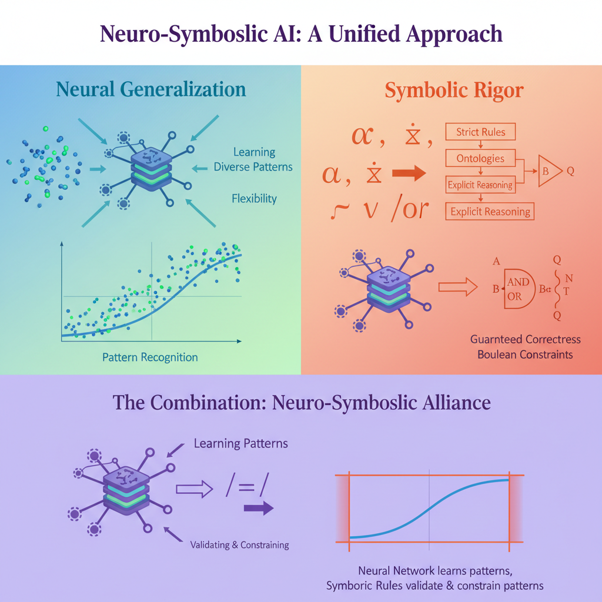
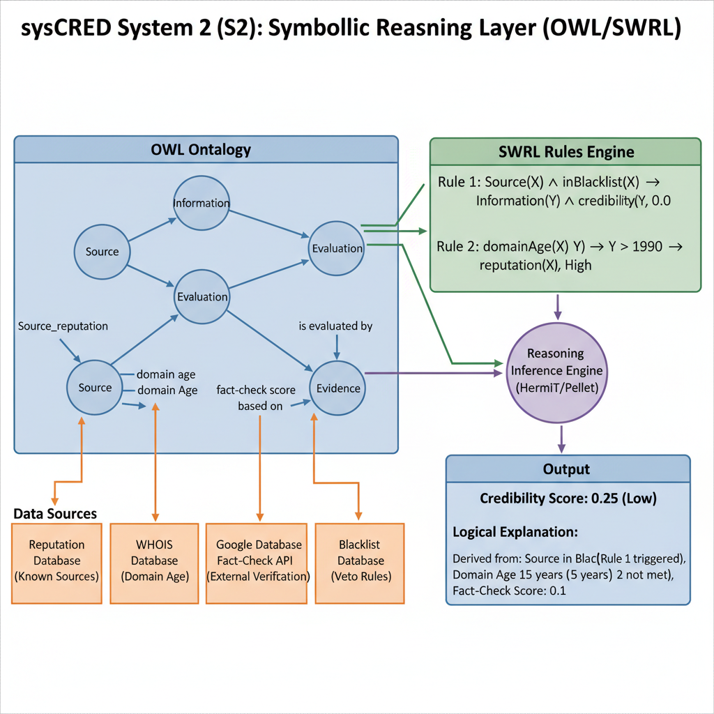
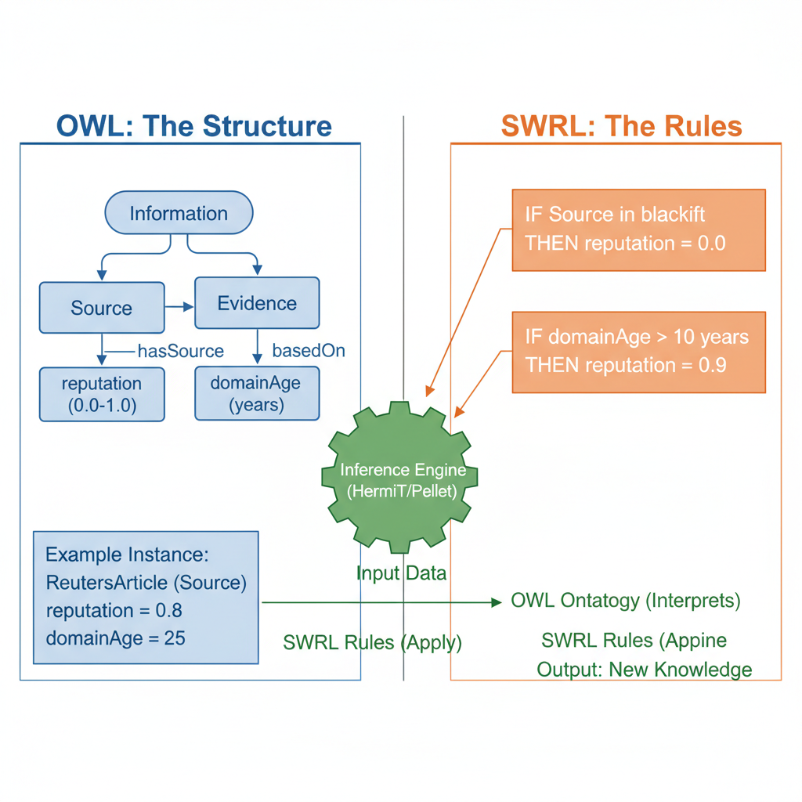

# Fact Checking System: Information Credibility Verification

[](https://badge.fury.io/py/syscred)
[](https://doi.org/10.5281/zenodo.18436691)
[](https://www.python.org/downloads/)
[](https://opensource.org/licenses/MIT)
[](https://colab.research.google.com/github/DominiqueLoyer/systemFactChecking/blob/main/02_Code/v2_syscred/syscred_colab.ipynb)
[](https://kaggle.com/kernels/welcome?src=https://github.com/DominiqueLoyer/systemFactChecking/blob/main/02_Code/v2_syscred/syscred_kaggle.ipynb)
[](https://www.w3.org/OWL/)
[](https://www.w3.org/TR/turtle/)
[](https://opensource.org/licenses/MIT)
[](https://www.buymeacoffee.com/dominiqueloyer)
[](https://github.com/sponsors/DominiqueLoyer)

**PhD Thesis Prototype** - Dominique S. Loyer  
*Citation Key: loyerModelingHybridSystem2025*

> [!NOTE]
> **New in v2.2 (Jan 29, 2026)**:
> - **GraphRAG**: Contextual memory from Knowledge Graph.
> - **Interactive Graph**: D3.js visualization with physics and details on click.
> - **Cloud Ready**: Docker & Supabase integration.

---

## 📋 Overview

A **neuro-symbolic AI system** for verifying information credibility that combines:

- **Symbolic AI**: Rule-based reasoning with OWL ontologies (RDF/Turtle)
- **Neural AI**: Transformer models for sentiment analysis and NER
- **IR Engine**: BM25, TF-IDF, and PageRank estimation

The system provides explainable credibility scores (High/Medium/Low) with detailed factor breakdown.

---

## 🚀 Quick Start (v2.2 - January 2026)

### Installation via PyPI (Recommended)

#### Option 1: Minimal Installation (Lightweight, ~100 MB)

Perfect for exploring the code, basic credibility checking without ML features:

```bash
pip install syscred
```

#### Option 2: With Machine Learning (Complete, ~2.5 GB)

Includes PyTorch, Transformers, and all ML models for full credibility analysis:

```bash
pip install syscred[ml]
```

#### Option 3: Full Installation (All features)

Includes ML, production tools, and development dependencies:

```bash
pip install syscred[all]
```

### Alternative: Run on Kaggle/Colab

1. Click the **Kaggle** or **Colab** badge above
2. Enable GPU runtime
3. Run All cells

### Alternative: Local Installation with Docker

```bash
# Clone the repository
git clone https://github.com/DominiqueLoyer/systemFactChecking.git
cd systemFactChecking/02_Code

# Run with Startup Script (Mac/Linux)
./start_syscred.sh
# Access at http://localhost:5001
```

### Python API Usage

```python
from syscred import CredibilityVerificationSystem

# Initialize
system = CredibilityVerificationSystem()

# Verify a URL
result = system.verify_information("https://www.lemonde.fr/article")
print(f"Score: {result['scoreCredibilite']} ({result['niveauCredibilite']})")

# Verify text directly
result = system.verify_information(
    "According to Harvard researchers, the new study shows significant results."
)
```

---

## 📡 REST API Endpoints

| Endpoint | Method | Description |
|----------|--------|-------------|
| `/api/verify` | POST | Full credibility verification |
| `/api/seo` | POST | SEO analysis only (faster) |
| `/api/ontology/stats` | GET | Ontology statistics |
| `/api/health` | GET | Server health check |

### Example Request

```bash
curl -X POST http://localhost:5000/api/verify \
  -H "Content-Type: application/json" \
  -d '{"input_data": "https://www.bbc.com/news/article"}'
```

### Example Response

```json
{
  "scoreCredibilite": 0.78,
  "niveauCredibilite": "HIGH",
  "analysisDetails": {
    "sourceReputation": "High",
    "domainAge": 9125,
    "sentiment": {"label": "NEUTRAL", "score": 0.52},
    "entities": [{"word": "BBC", "entity_group": "ORG"}]
  }
}
```

---
```bash
## 📁 Project Structure

hybrid-credibility-system/
├── README.md                           # Documentation principale
├── docker-compose.yml                  # Orchestration des conteneurs
├── .env.example                        # Variables d'environnement
│
├── ontology/
│   ├── sysCRED_ontology.owl           # ⭐ Ontologie principale (OWL)
│   ├── sysCRED_data.ttl               # Données RDF (Turtle)
│   ├── swrl_rules.swrl                # Règles SWRL pour inférence
│   └── individuals.ttl                # Instances (sources, domaines)
│
├── services/
│   │
│   ├── s1_neural/                     # 🧠 Couche Neurale (S1)
│   │   ├── ner_service/
│   │   │   ├── Dockerfile
│   │   │   ├── requirements.txt
│   │   │   ├── app.py                # API: /extract/entities
│   │   │   └── models/
│   │   │       └── bert_ner/         # Modèle BERT fine-tuned
│   │   │
│   │   ├── sentiment_service/
│   │   │   ├── Dockerfile
│   │   │   ├── requirements.txt
│   │   │   ├── app.py                # API: /extract/sentiment
│   │   │   └── models/
│   │   │       └── distilbert/       # Modèle DistilBERT
│   │   │
│   │   └── coherence_service/
│   │       ├── Dockerfile
│   │       ├── requirements.txt
│   │       └── app.py                # API: /extract/coherence
│   │
│   ├── bridge/                        # 🌉 Grounding Layer
│   │   ├── Dockerfile
│   │   ├── requirements.txt
│   │   ├── grounding.py              # Neural → Symbolic mapping
│   │   └── embeddings/
│   │       └── entity_mapper.pkl     # Embeddings → OWL instances
│   │
│   ├── s2_symbolic/                   # 🔣 Couche Symbolique (S2)
│   │   ├── knowledge_graph/
│   │   │   ├── Dockerfile
│   │   │   ├── requirements.txt
│   │   │   ├── app.py                # API: /graph/query
│   │   │   └── neo4j/
│   │   │       └── init.cypher       # Scripts d'initialisation
│   │   │
│   │   ├── reasoner_service/
│   │   │   ├── Dockerfile
│   │   │   ├── requirements.txt
│   │   │   ├── app.py                # API: /reason/infer
│   │   │   └── lib/
│   │   │       ├── hermit.jar        # Reasoner HermiT
│   │   │       └── pellet.jar        # Reasoner Pellet
│   │   │
│   │   └── fact_check_service/
│   │       ├── Dockerfile
│   │       ├── requirements.txt
│   │       ├── app.py                # API: /factcheck/verify
│   │       └── config/
│   │           └── api_keys.yml      # Google Fact-Check API
│   │
│   └── api_gateway/                   # 🚪 API Gateway (Orchestration)
│       ├── Dockerfile
│       ├── requirements.txt
│       ├── gateway.py                # API: /verify (main endpoint)
│       ├── pipeline.py               # Orchestration des 8 étapes
│       └── schemas/
│           ├── input_schema.json
│           └── output_schema.json
│
├── data/
│   ├── sources/
│   │   └── trusted_sources.csv       # Liste sources fiables
│   ├── blacklist/
│   │   └── blacklisted_domains.csv   # Domaines bloqués
│   └── training/
│       ├── ner_dataset.json
│       └── sentiment_dataset.json
│
├── tests/
│   ├── test_s1_neural.py
│   ├── test_s2_symbolic.py
│   ├── test_bridge.py
│   └── test_integration.py
│
├── docs/
│   ├── architecture.md               # Architecture détaillée
│   ├── api_documentation.md          # Documentation API
│   ├── ontology_design.md            # Design de l'ontologie
│   └── deployment.md                 # Guide de déploiement
│
└── scripts/
    ├── setup.sh                      # Installation des dépendances
    ├── start_services.sh             # Démarrage des conteneurs
    └── load_ontology.py              # Chargement ontologie dans triplestore
┌─────────────────────────────────────────────────────────────────┐
│                        INPUT (User)                              │
│                   URL ou Texte d'article                         │
└────────────────────────────┬────────────────────────────────────┘
                             ↓
┌─────────────────────────────────────────────────────────────────┐
│                   LAYER 1: Neural (S1)                           │
│  ┌──────────────┐  ┌──────────────┐  ┌──────────────┐          │
│  │   NER        │  │  Sentiment   │  │  Coherence   │          │
│  │   (BERT)     │  │ (DistilBERT) │  │   Analysis   │          │
│  └──────────────┘  └──────────────┘  └──────────────┘          │
└────────────────────────────┬────────────────────────────────────┘
                             ↓
┌─────────────────────────────────────────────────────────────────┐
│                    BRIDGE: Grounding                             │
│              Neural Embeddings → OWL Instances                   │
└────────────────────────────┬────────────────────────────────────┘
                             ↓
┌─────────────────────────────────────────────────────────────────┐
│                  LAYER 2: Symbolic (S2)                          │
│  ┌──────────────┐  ┌──────────────┐  ┌──────────────┐          │
│  │  Knowledge   │  │  Reasoner    │  │  Fact-Check  │          │
│  │  Graph       │  │ (HermiT)     │  │  API         │          │
│  │  (Neo4j)     │  │              │  │              │          │
│  └──────────────┘  └──────────────┘  └──────────────┘          │
└────────────────────────────┬────────────────────────────────────┘
                             ↓
┌─────────────────────────────────────────────────────────────────┐
│                    SCORING & EXPLANATION                         │
│              Credibility Score + Reasoning Trace                 │
└────────────────────────────┬────────────────────────────────────┘
                             ↓
┌─────────────────────────────────────────────────────────────────┐
│                      OUTPUT (JSON)                               │
│          Score, Level, Explanation, Confidence                   │
└─────────────────────────────────────────────────────────────────┘


---

## 🔧 Configuration

Set environment variables or edit `02_Code/v2_syscred/config.py`:

```bash
# Optional: Google Fact Check API key
export SYSCRED_GOOGLE_API_KEY=your_key_here

# Server settings
export SYSCRED_PORT=5000
export SYSCRED_DEBUG=true
export SYSCRED_ENV=production  # or development, testing
```

---

## 📊 Credibility Scoring

The system uses weighted factors to calculate credibility:

| Factor | Weight | Description |
|--------|--------|-------------|
| Source Reputation | 25% | Known credible sources database |
| Domain Age | 10% | WHOIS lookup for domain history |
| Sentiment Neutrality | 15% | Extreme sentiment = lower score |
| Entity Presence | 15% | Named entities (ORG, PER) |
| Text Coherence | 15% | Vocabulary diversity |
| Fact Check | 20% | Google Fact Check API results |

**Thresholds:**

- **HIGH**: Score ≥ 0.7
- **MEDIUM**: 0.4 ≤ Score < 0.7
- **LOW**: Score < 0.4

---

## 📚 Documentation & Papers

- [Modeling and Hybrid System for Verification of Sources Credibility (PDF)](03_Docs/Modeling%20and%20Hybrid%20System%20for%20Verification%20of%20sources%20credibility.pdf)
- [Ontology of a Verification System (PDF)](03_Docs/Ontology_of_a_verification_system_for_liability_of_the_information_may15_2025.pdf)
- [Beamer Presentation - DIC9335 (PDF)](01_Presentations/syscred_presentation.pdf)

---

## 🏷️ Citation

```bibtex
@software{loyer2025syscred,
  author = {Loyer, Dominique S.},
  title = {SysCRED: Neuro-Symbolic System for Information Credibility Verification},
  year = {2026},
  publisher = {GitHub},
  url = {https://github.com/DominiqueLoyer/systemFactChecking}
}
```

---

## 📜 License

MIT License - See [LICENSE](LICENSE) for details.

---

## 🔄 Version History

| Version | Date | Changes |
|---------|------|---------|
| v2.0 | Jan 2026 | Complete rewrite with modular architecture, Kaggle/Colab support, REST API |
| v1.0 | Apr 2025 | Initial prototype with basic credibility scoring |

___
## Présentation des graphes (Generated By Perplexity AI) (-_-) Funny!











