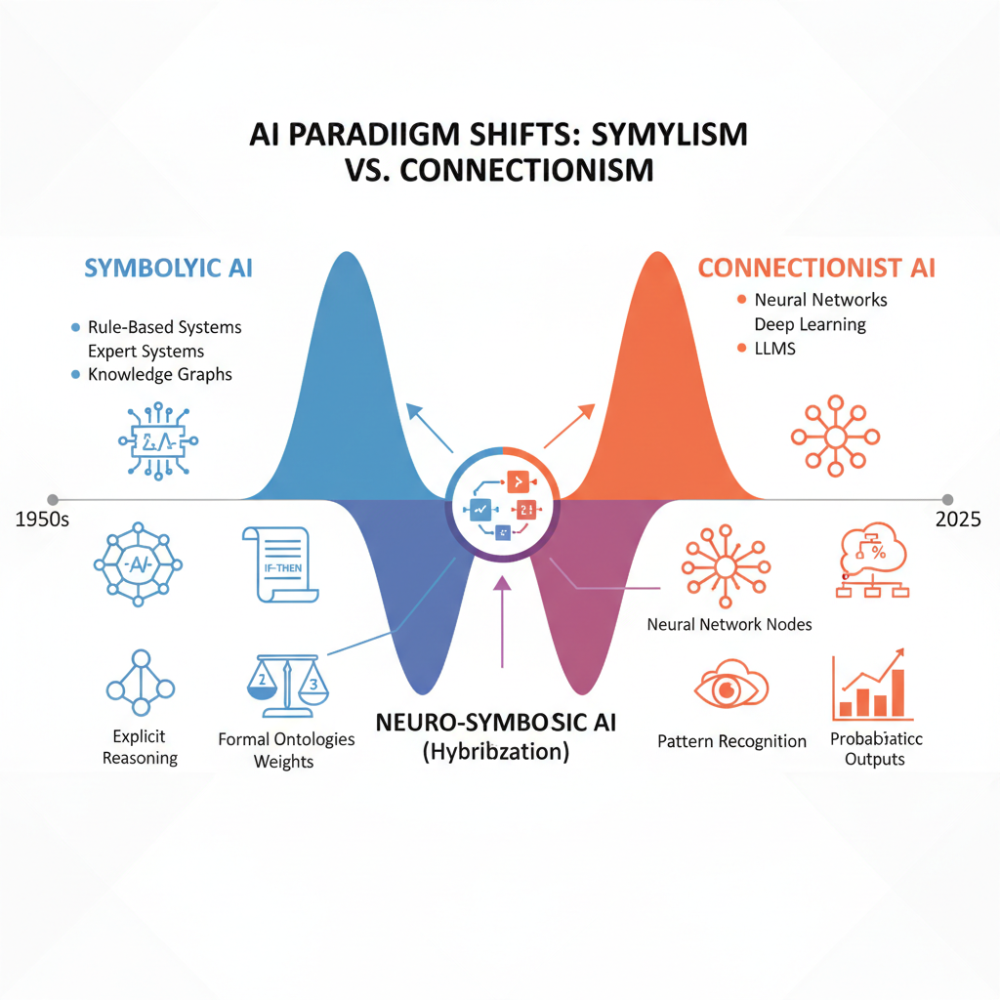
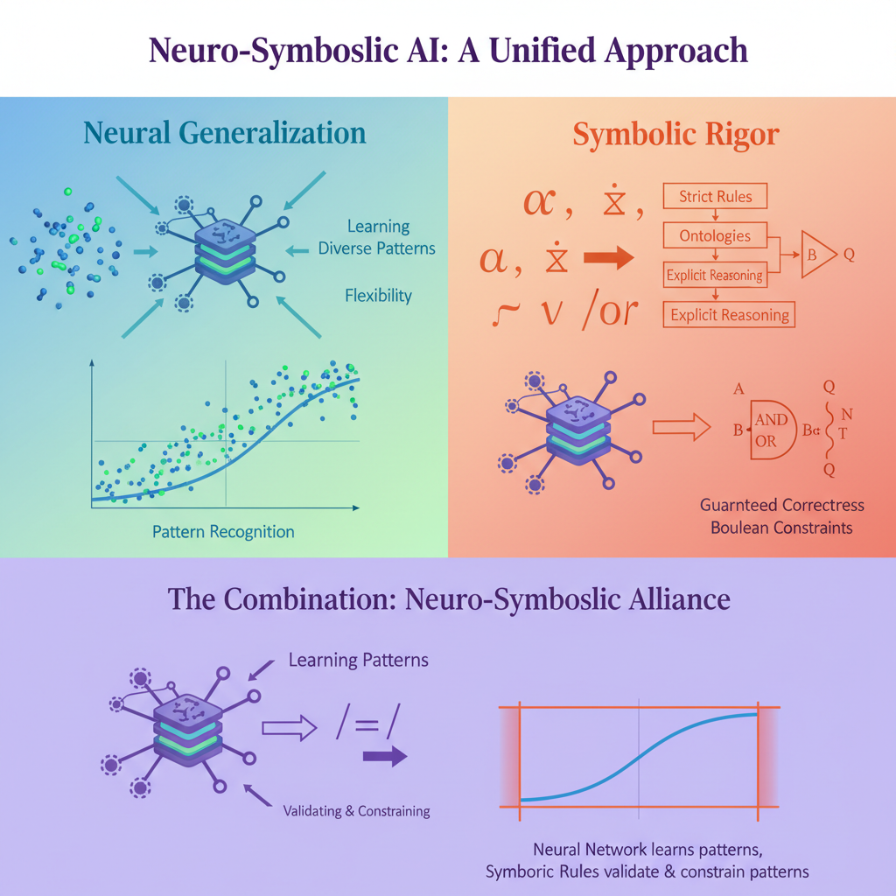

# SysCRED — Système Neuro-Symbolique de Vérification de Crédibilité

[](https://badge.fury.io/py/syscred)
[](https://doi.org/10.5281/zenodo.18436691)
[](https://www.python.org/downloads/)
[](https://opensource.org/licenses/MIT)
[](https://colab.research.google.com/github/DominiqueLoyer/systemFactChecking/blob/main/02_Code/v2_syscred/syscred_colab.ipynb)
[](https://www.w3.org/OWL/)
[](https://www.w3.org/TR/turtle/)

**PhD Thesis Prototype** — Dominique S. Loyer (UQAM)  
*Citation Key: loyerModelingHybridSystem2025*

> [!NOTE]
> **Version stable : v2.3 (8-9 février 2026)**
> - **Fact-Checking** multi-sources (Google Fact Check API)
> - **E-E-A-T** (Experience, Expertise, Authority, Trust)
> - **NER** — Extraction d'entités nommées (spaCy)
> - **GraphRAG** — Réseau Neuro-Symbolique (D3.js)
> - **IR Engine** — BM25, TF-IDF, PageRank
> - **Métriques** — Precision, Recall, nDCG, MRR

# Restructuration de sysCRED 210226

```bash
systemFactChecking_Sandbox/
├── syscred/                    # ← Package Python unique et propre
│   ├── __init__.py
│   ├── backend_app.py          # API Flask
│   ├── verification_system.py  # Système principal
│   ├── config.py
│   ├── ner_analyzer.py         # ← À restaurer
│   ├── eeat_calculator.py      # ← À restaurer
│   ├── graph_rag.py
│   ├── ontology_manager.py
│   ├── api_clients.py
│   ├── seo_analyzer.py
│   ├── ir_engine.py
│   ├── eval_metrics.py
│   ├── trec_retriever.py
│   ├── trec_dataset.py
│   ├── liar_dataset.py
│   ├── database.py
│   └── static/
│       └── index.html
├── huggingface_space/
│   ├── Dockerfile              # ← Mis à jour
│   └── README.md
├── requirements.txt            # ← Allégé pour Render
├── requirements-full.txt       # ← Version complète pour HF/local
├── Dockerfile                  # Pour Render
├── .env
├── README.md
├── 03_Docs/
├── 99_Archive/                 # ← Anciennes versions archivées
└── ...
```

---

## 📋 Overview

A **neuro-symbolic AI system** for verifying information credibility that combines:

- **Symbolic AI**: Rule-based reasoning with OWL ontologies (RDF/Turtle)
- **Neural AI**: Transformer models for sentiment analysis (DistilBERT) and NER (spaCy)
- **IR Engine**: BM25, TF-IDF, and PageRank estimation
- **E-E-A-T**: Google Quality Rater Guidelines scoring

The system provides explainable credibility scores (High/Medium/Low) with detailed factor breakdown.

---

## 📁 Project Structure

```
systemFactChecking_Production/
├── README.md                       # This file
├── LICENSE
├── pyproject.toml                  # Python/PyPI config
├── Dockerfile                      # Container deployment
├── .gitignore
│
├── src/                            # ⭐ SOURCE CODE (single source of truth)
│   └── syscred/
│       ├── __init__.py
│       ├── backend_app.py          # Flask server (entry point)
│       ├── verification_system.py  # Main verification pipeline
│       ├── api_clients.py          # External API clients
│       ├── config.py               # Configuration
│       ├── database.py             # DB management (SQLAlchemy)
│       ├── ir_engine.py            # IR engine (BM25, TF-IDF)
│       ├── ontology_manager.py     # Ontology management
│       ├── seo_analyzer.py         # SEO analysis
│       ├── eval_metrics.py         # Evaluation metrics
│       ├── graph_rag.py            # GraphRAG module
│       ├── ner_analyzer.py         # NER (spaCy)
│       ├── eeat_calculator.py      # E-E-A-T scoring
│       └── static/
│           └── index.html          # Frontend dashboard
│
├── 02_Code/                        # Legacy code directory
│   ├── syscred/                    # Older version of the package
│   ├── v2_syscred/                 # v2 with Colab/Kaggle notebooks
│   └── Dockerfile
│
├── tests/                          # Unit tests
├── 01_Presentations/               # PhD presentations (LaTeX)
├── 03_Docs/                        # Documentation & dev logs
├── 04_Bibliography/                # Research references
├── 99_Archive/                     # Archived older versions
│
├── ontology/                       # OWL/RDF ontology files
├── syscred-space/                  # HuggingFace Space deployment
└── assets/                         # Images and graphs
```

---

## 🚀 Quick Start

### Installation via PyPI

```bash
# Minimal (lightweight, ~100 MB)
pip install syscred

# With ML models (complete, ~2.5 GB)
pip install syscred[ml]

# Full (all features + dev tools)
pip install syscred[all]
```

### Local Development

```bash
cd systemFactChecking_Production
python -m venv .venv
source .venv/bin/activate
pip install -r src/syscred/requirements.txt
python src/syscred/backend_app.py
# → Access at http://localhost:5001
```

### Docker

```bash
docker build -t syscred:latest .
docker run -p 5000:5000 --env-file .env syscred:latest
```

---

## 📡 REST API

| Endpoint | Method | Description |
|----------|--------|-------------|
| `/api/verify` | POST | Full credibility verification |
| `/api/seo` | POST | SEO analysis only |
| `/api/ontology/stats` | GET | Ontology statistics |
| `/api/ontology/graph` | GET | D3.js graph data |
| `/api/health` | GET | Server health check |

### Example

```bash
curl -X POST http://localhost:5001/api/verify \
  -H "Content-Type: application/json" \
  -d '{"input_data": "La Terre est ronde"}'
```

---

## 📊 Credibility Scoring

| Factor | Weight | Description |
|--------|--------|-------------|
| Source Reputation | 25% | Known credible sources database |
| Domain Age | 10% | WHOIS lookup for domain history |
| Sentiment Neutrality | 15% | Extreme sentiment = lower score |
| Entity Presence | 15% | Named entities (ORG, PER) |
| Text Coherence | 15% | Vocabulary diversity |
| Fact Check | 20% | Google Fact Check API results |

**E-E-A-T Score** (Google Quality Rater):
- **Experience**: Domain age, content richness
- **Expertise**: Technical vocabulary, citations
- **Authority**: Estimated PageRank, backlinks
- **Trust**: HTTPS, unbiased sentiment

---

## 🔧 Configuration

```bash
# Optional: Google Fact Check API key
export SYSCRED_GOOGLE_API_KEY=your_key_here

# Server settings
export SYSCRED_PORT=5001
export SYSCRED_DEBUG=true
export SYSCRED_ENV=production
```

---

## 📚 Documentation

- [System Documentation](03_Docs/DOCUMENTATION.md)
- [TREC Integration Guide](03_Docs/TREC_Integration_Documentation.md)
- [DevLog Feb 8, 2026](03_Docs/03_DevLog_2026-02-08.md)

---

## 🏷️ Citation

```bibtex
@software{loyer2026syscred,
  author = {Loyer, Dominique S.},
  title = {SysCRED: Neuro-Symbolic System for Information Credibility Verification},
  year = {2026},
  publisher = {GitHub},
  url = {https://github.com/DominiqueLoyer/systemFactChecking}
}
```

---

## 📜 License

MIT License — See [LICENSE](LICENSE).

---

## 🔄 Version History

| Version | Date | Changes |
|---------|------|---------|
| v2.3 | Feb 8-9, 2026 | NER, E-E-A-T, Google Fact Check API, GraphRAG, blue glow UI |
| v2.2 | Jan 29, 2026 | GraphRAG, D3.js graph, Docker & Supabase integration |
| v2.0 | Jan 2026 | Complete rewrite, modular architecture, REST API |
| v1.0 | Apr 2025 | Initial prototype |



